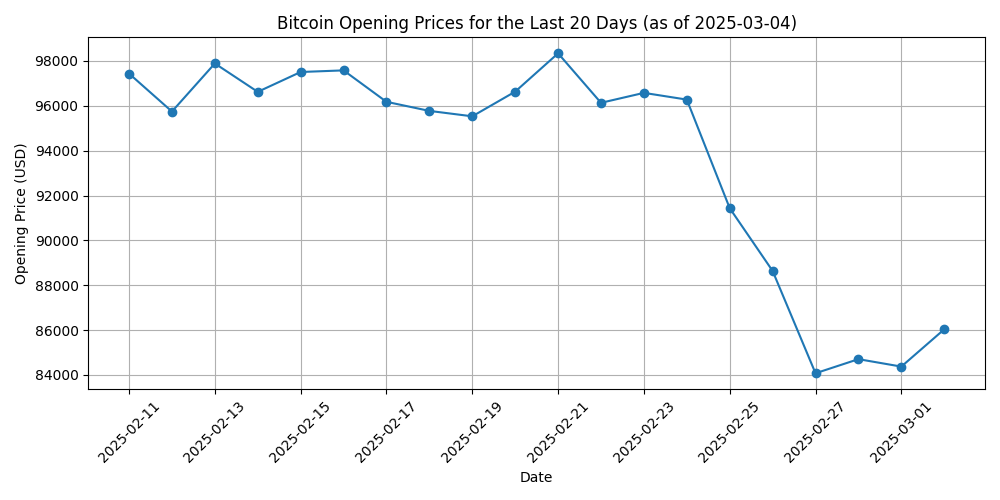

# Bitcoin Market Analysis: Last 20 Days Trend Report

## Introduction
This report provides a detailed analysis of Bitcoin's market trends, focusing specifically on the opening prices over the last 20 trading days leading up to March 04, 2025. The data was obtained from Yahoo Finance and is plotted to illustrate the movements in Bitcoin's value.

## Analysis
The plot illustrates the fluctuations in Bitcoin's opening prices over the observed period. During this time frame, Bitcoin has experienced noticeable fluctuations. Starting at $97,438.13 on February 11, 2025, the prices show a trend with a general decrease and substantial volatility. The noted sharp declines are observed towards the end of February, where the price dropped to $84,373.87 on March 1, 2025. The observed highs and lows may be linked to economic events, regulatory news, or shifts in market sentiment.

## Implications for Investors
- The trend provides insights into investor sentiment and market dynamics, reflecting potential overreactions to external events.
- Investors should consider maintaining cautious optimism, carefully monitoring market signals, and staying informed about global economic news affecting cryptocurrencies.
- The observed volatility could present potential buying opportunities for investors looking to enter at lower price points.

## Conclusion
In conclusion, the opening price trend offers essential insights into Bitcoin's market behavior. Investors should continue to monitor economic indicators and global news that might affect cryptocurrency markets in the near future. Understanding these dynamics will be essential in making informed investment decisions and managing risk effectively.
